<!--
  Все картинки в assets/ нарисованы кодом (scripts/), статистика и змейка
  обновляются GitHub Actions в ветке `output`. Пересобрать ассеты: npm run build
-->

<a href="https://github.com/Cyber07200">
  
</a>

  
  
  

 

<picture>
  <source media="(prefers-color-scheme: dark)" srcset="assets/sections/01-dark.svg" />
  
</picture>


#### Чем могу быть полезен

- 🎨 **UI/UX-дизайн** — макеты и прототипы в Figma, дизайн-системы и токены, продуманная типографика
- ⚛️ **Frontend** — React + TypeScript, чистая архитектура компонентов, быстрый и доступный интерфейс
- 🌌 **Creative / 3D** — Three.js и React Three Fiber, GSAP ScrollTrigger, шейдеры, сторителлинг на скролле
- 📱 **Mobile** — React Native + Expo, local-first, Skia, перенос веб-продукта на телефон по Figma

 

<picture>
  <source media="(prefers-color-scheme: dark)" srcset="assets/sections/02-dark.svg" />
  
</picture>

  <a href="https://github.com/Cyber07200/dimension"></a>
  <a href="https://github.com/Cyber07200/NOVA-Photo"></a>

  <a href="https://github.com/Cyber07200/pocket-film"></a>
  <a href="https://github.com/Cyber07200/instrumentum"></a>

  <a href="https://github.com/Cyber07200/Avora"></a>
  <a href="https://github.com/Cyber07200/Planet-kid-mobile"></a>

<b>Ещё проекты</b>

 

| Проект | О чём | Стек |
| --- | --- | --- |
| 🌌 [**Digital Universe**](https://github.com/Cyber07200/tools-hub) | Интерактивный 3D-сайт: 4 темы, свой smooth-scroll, рабочий терминал, code-splitting | React 19 · TS · R3F · GSAP |
| 🛒 [**frontend-checkout-challenge**](https://github.com/Cyber07200/frontend-checkout-challenge) | Тестовое: каталог, корзина, оформление заказа и оплата тестовой картой | TypeScript |
| 🤝 [**valantur_hub_normal**](https://github.com/Cyber07200/valantur_hub_normal) | Платформа для поиска волонтёрской деятельности | JavaScript · PostgreSQL · Kotlin |
| ✅ [**task-manager**](https://github.com/Cyber07200/task-manager) | Управление задачами с анимациями и подзадачами | React |

 

<picture>
  <source media="(prefers-color-scheme: dark)" srcset="assets/sections/03-dark.svg" />
  
</picture>

  <b>Дизайн</b>  
  

  <b>Frontend и creative</b>  
  

  <b>Бэкенд, данные и прочее</b>  
  

 

<picture>
  <source media="(prefers-color-scheme: dark)" srcset="assets/sections/04-dark.svg" />
  
</picture>

 

<picture>
  <source media="(prefers-color-scheme: dark)" srcset="assets/sections/05-dark.svg" />
  
</picture>

<picture>
  <source media="(prefers-color-scheme: dark)" srcset="https://raw.githubusercontent.com/Cyber07200/Cyber07200/output/snake-dark.svg" />
  
</picture>

 

<picture>
  <source media="(prefers-color-scheme: dark)" srcset="assets/sections/06-dark.svg" />
  
</picture>

  <a href="https://t.me/MaimysAbrosimv"></a>
  <a href="mailto:abrosimov20062022@gmail.com"></a>
  

<b>🛠 Как устроен этот профиль</b>

 

Здесь нет готовых шаблонов, всё нарисовано кодом:

- **Hero, карточки и заголовки** генерирует Node-скрипт ([`scripts/`](scripts)). Текст переведён в векторные контуры через `opentype.js`, поэтому 10 шрифтов в шапке выглядят одинаково на любом устройстве.
- **Анимации** сделаны на чистом CSS и SMIL внутри SVG. Тессеракт вращается по настоящей 4D-матрице (плоскости XW и YZ), кадры посчитаны заранее. Ради `prefers-reduced-motion` анимации отключаются.
- **Статистику и змейку** GitHub Actions пересобирает каждые 12 часов из GitHub GraphQL API, без сторонних сервисов, которые могут упасть.
- **Заголовки секций** подстраиваются под светлую и тёмную тему GitHub.

 

